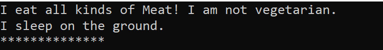
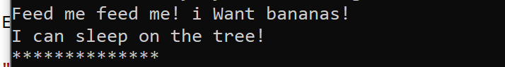
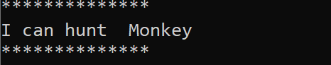
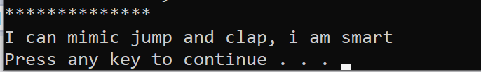

# ZOO

Description:

Using all 4 of the Object Oriented Principles (OOPs): - Build out the hierarchical class structure of the animals within a zoo within Visual Studio and a digital diagram.

There should be at least 3 layers of inheritance with at least 5 different types of animals.

# OOP PRICIPLES:

abstraction--the opsite type of concrete ,  is the process by which we can hide everything other than the relevant data about an object in order to simplify and increase efficiency.

inheritance--is the ability to receive (“inherit”) methods and properties from an existing class(base class).

polymorphism--is when each class implements the same methods in varying ways, but you can still have several classes that can be utilized interchangeably.

encapsulation-- is when a group of related methods, properties, and other members are treated as a single object.
                Access restriction - preventing one object from accessing another's internal state
                Namespaces/scopes - allowing the same name to have different meanings in different contexts.

The very first layer class is Animal, and it has three direct derived classes: Mammal, Reptile, Bird. These are  all abstract classes.

There are 7 types of Animals in this lab: Tiger, Monkey, Panda, Turtle, Owl, Ostrich. These are concrete classes and when they inherit base class

they need to implement all abstract methods in theri abstract base classes.
 
Different classes can display different methods based on OOP's polymorphism, for example, Eat() and Sleep() output differnt things

in Tiger and Monkey classes

Monkey has one derived class called HowlerMonkey. And HowlerMonkey has all base class Monkey's properties and methods.

# Interfaces

Definition:An interface in C# contains only the declaration of the methods, properties, and events, but not the implementation. 
It is left to the class that implements the interface by providing implementation for all the members of the interface.

And in the zoo, there are three Interfaces: Edible(for Ostrich and Monkey), Hunt(for Tiger and Owl), Mimic(for Monkey and GreyParrot).

So when you do : string foodOne = tiger.Hunt(monkey); 
                 Console.WriteLine($"I can hunt{foodOne}");
				 
				 it will output :

when you do  :   Console.WriteLine(monkey.Mimic("jump and clap"));  
   

The ouptput will be this:

              

 

 The whole zoo diagram is like this:

