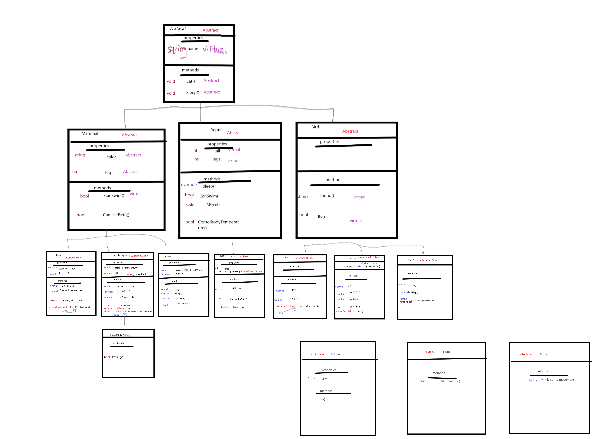

# ZOO

Description:

The very first layer class is Animal, and it has three direct derived classes: Mammal, Reptile, Bird.

There are 7 types of Animals in this lab: Tiger, Monkey, Panda, Turtle, Owl, Ostrich.
 
Monkey has one derived class called HowlerMonkey.

And in the zoo, there are three Interfaces: Edible(for Ostrich and Monkey), Hunt(for Tiger and Owl), Mimic(for Monkey and GreyParrot).

